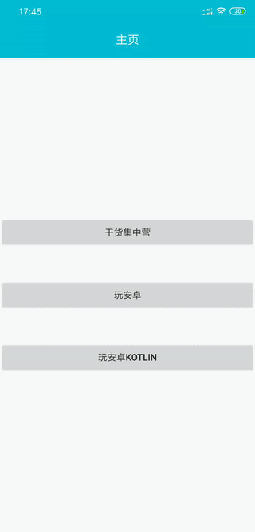
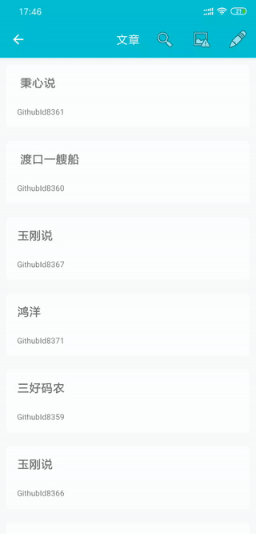
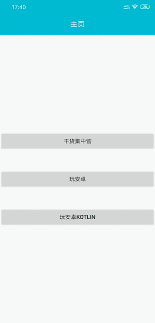
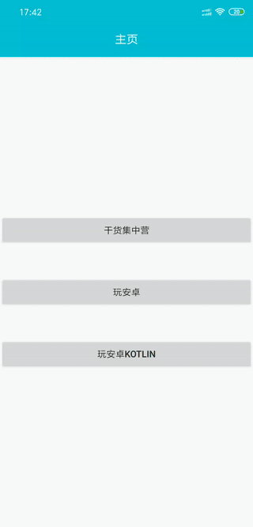
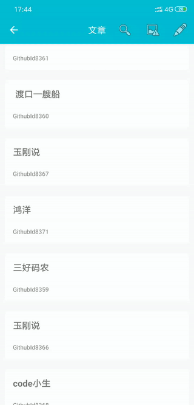

[](https://jitpack.io/#coolfire2015/RxFluxArchitecture)
[](https://android-arsenal.com/api?level=19)
[](https://app.codacy.com/app/coolfire2015/RxFluxArchitecture?utm_source=github.com&utm_medium=referral&utm_content=coolfire2015/RxFluxArchitecture&utm_campaign=Badge_Grade_Dashboard)
[](https://travis-ci.org/coolfire2015/RxFluxArchitecture)
## Demo下载地址

## 效果图









## 架构图


## 框架介绍

* 该框架使用 Flux 架构，数据朝单一方向流动。
* 上一级不需要持有下一级对象，不需要知道下一级如何实现响应。
* ActionCreator 类似 MVP 架构中的 Presenter，只是其中不持有 View 对象，无需操作结束回调 View 的响应方法。
* Store 继承自`androidx.lifecycle.ViewModel`，可以通过`androidx.lifecycle.LiveData<T>`实现 MVVM 架构。
* Store 自动关联 View 生命周期，维持设备横竖屏切换时数据。
* View，Store 自动注册订阅、解除订阅。
* 使用 Dagger.Android 实现 View (Activity/Fragment)的依赖注入。
* 使用实现 Tag 功能的 EventBus 实现数据总线功能。

## 功能实现1：操作响应`RxAction`和`RxChange`，以登录功能为例
1. **View**

在`LoginFragment `点击登录按钮，调用`LoginActionCreator`中的方法`login(String,String)`。
```
    @OnClick(R2.id.btn_login)
    public void login() {
        mActionCreator.login(username, password);
    }
```
2.  **ActionCreator**

在`LoginActionCreator`的方法`login(String,String)`中`postHttpAction(RxAction, Observable<T>)`方法会调用`WanApi`接口方法进行登录操作，登录完成后发送封装接口返回结果的`RxAction`（包含Tag`LoginAction.LOGIN`）。
```
    @Override
    public void login(String username, String password) {
        RxAction rxAction = newRxAction(LoginAction.LOGIN);
        postHttpAction(rxAction, mWanApi.login(username, password).flatMap(verifyResponse()));
    }
```
3. **Store**

在`LoginStore`中接收Tag为`LoginAction.LOGIN`，数据类型为`RxAction`的通知。取出`RxAction`中封装的接口返回数据，然后使用方法`postChange(RxChange)`通知 View 进行 UI 响应操作。

```
    @Subscribe(tags = {LoginAction.LOGIN})
    public void onLogin(RxAction rxAction) {
        mUser = rxAction.getResponse();
        postChange(RxChange.newInstance(rxAction.getTag()));
    }
```
4. **View**

在`LoginActivity`中接收Tag为`LoginAction.LOGIN`，数据类型为`RxChange `的通知，跳转其他页面。
```
    @Subscribe(tags = {LoginAction.LOGIN}, sticky = true)
    public void onLogin(RxChange rxChange) {
        startActivity(new Intent(this, ArticleActivity.class));
        finish();
    }
```
## 功能实现2：进度通知`RxLoading`

1.  **ActionCreator**

在`LoginActionCreator`中使用`postHttpLoadingAction(RxAction, Observable<T>)`方法。
操作开始时，发送进度开始通知`RxLoading`；
操作完成，发送封装接口返回结果的`RxAction`（包含Tag`LoginAction.LOGIN`）；
操作结束后，发送进度结束通知`RxLoading`。
```
    @Override
    public void login(String username, String password) {
        RxAction rxAction = newRxAction(LOGIN);
        postHttpLoadingAction(rxAction, mWanApi.login(username, password).flatMap(verifyResponse()));
    }
```
2. **View**

在`BaseActivity`中全局响应`RxLoading`
```
    @Subscribe(sticky = true)
    public void onRxLoading(@NonNull RxLoading rxLoading) {
        if (rxLoading.isLoading()) {
            //显示进度框
        } else {
            //隐藏进度框
        }
    }
```
或者在特定 View `LoginActivity`中重写`onRxLoading(RxLoading)`方法，单独响应Tag为`LoginAction.LOGIN`的`RxLoading`。
```
    @Override
    @Subscribe(sticky = true)
    public void onRxLoading(@NonNull RxLoading rxLoading) {
        if (TextUtils.equals(rxLoading.getTag(), LoginAction.LOGIN)) {
            if (rxLoading.isLoading()) {
                //显示进度框
            } else {
                //隐藏进度框
            }
        }
    }
```
## 功能实现3：操作异常`RxError`
`RxActionCretor` 中`postHttpAction(RxAction, Observable<T>)`和`postHttpLoadingAction(RxAction, Observable<T>)`方法，如果有异常，会发送操作异常通知`RxError`。
可以在`BaseActivity`中全局响应`RxError`
```
    @Subscribe(sticky = true)
    public void onRxError(@NonNull RxError rxError) {
        Throwable throwable = rxError.getThrowable();
        if (throwable instanceof CommonException) {
            Toast.makeText(this, ((CommonException) throwable).message(), Toast.LENGTH_SHORT).show();
        } else if (throwable instanceof retrofit2.HttpException) {
            Toast.makeText(this, ((retrofit2.HttpException) throwable).code() + ":服务器问题", Toast.LENGTH_SHORT).show();
        } else if (throwable instanceof SocketException) {
            Toast.makeText(this, "网络异常!", Toast.LENGTH_SHORT).show();
        } else if (throwable instanceof UnknownHostException) {
            Toast.makeText(this, "网络异常!", Toast.LENGTH_SHORT).show();
        } else if (throwable instanceof SocketTimeoutException) {
            Toast.makeText(this, "连接超时!", Toast.LENGTH_SHORT).show();
        } else {
            Toast.makeText(this, throwable.toString(), Toast.LENGTH_SHORT).show();
        }
    }
```
或者在特定 View `LoginActivity`中重写`onRxError(RxError)`方法，单独响应Tag为`LoginAction.LOGIN`的`RxError`。
```
    @Override
    @Subscribe(sticky = true)
    public void onRxError(@NonNull RxError rxError) {
        if (TextUtils.equals(rxError.getTag(), LoginAction.LOGIN)) {
           //单独处理操作异常...
        }
    }
```
## 功能实现4：异常重试`RxRtry`

1.  **ActionCreator**

在`FriendActionCreator`中使用`postHttpRetryAction(RxAction, Observable<T>)`方法，如果操作有异常，会发送异常重试通知`RxRetry`
```
    @Override
    public void getFriendList() {
        RxAction rxAction = newRxAction(FriendAction.GET_FRIEND_LIST);
        postHttpRetryAction(rxAction, mWanApi.getFriendList());
    }
```
2. **View**

在`BaseActivity`中全局响应`RxRetry`，可以使用`RxActionCreator`中的`postRetryAction(RxRetry)`方法重试。
```
    @Subscribe(sticky = true)
    public void onRxRetry(@NonNull RxRetry rxRetry) {
        CoordinatorLayout coordinatorLayout = findViewById(R.id.cdl_content);
        if (coordinatorLayout == null) {
            return;
        }
        Snackbar snackbar = Snackbar.make(coordinatorLayout, rxRetry.getTag(), Snackbar.LENGTH_INDEFINITE);
        snackbar.setAction("Retry", v -> mCommonActionCreatorLazy.get().postRetryAction(rxRetry)).show();
    }
```
或者在特定 View 中重写`onRxRetry(RxRetry)`方法，单独响应特定Tag的`RxRetry`。
```
    @Override
    @Subscribe(sticky = true)
    public void onRxRetry (@NonNull RxRetry rxRetry) {
        if (TextUtils.equals(rxRetry.getTag(), FriendAction.GET_FRIEND_LIST)) {
            //单独处理异常重试...
        }
    }
```


## 依赖框架
### 核心
- 依赖注入 [**Dagger+Dagger.Android**](https://github.com/google/dagger)
- 函数编程 [**RxJava**](https://github.com/ReactiveX/RxJava)
+[**RxAndroid**](https://github.com/ReactiveX/RxAndroid)
- AndroidX [**X-Core**](https://mvnrepository.com/artifact/androidx.core/core)
+[**X-AppCompat**](https://mvnrepository.com/artifact/androidx.appcompat/appcompat)
+[**X-Lifecycle**](https://mvnrepository.com/artifact/androidx.lifecycle/lifecycle-extensions)
- AndroidX迁移 [**Jetifier**](https://mvnrepository.com/artifact/com.android.tools.build.jetifier/jetifier-core)
### 通用
- 模块路由 [**Arouter**](https://github.com/alibaba/ARouter)
- View注入 [**ButterKnife**](https://github.com/JakeWharton/butterknife)
- 网络框架 [**OkHttp**](https://github.com/square/okhttp)
+[**OkIo**](https://github.com/square/okio)
+[**Retrofit**](https://github.com/square/retrofit)
- 图片加载 [**Glide**](https://github.com/bumptech/glide)
- 日志展示 [**Logger**](https://github.com/orhanobut/logger)
- 数据解析 [**Fastjson**](https://github.com/alibaba/fastjson)
+[**Gson**](https://github.com/google/gson)
- 内存泄漏 [**LeakCanary**](https://github.com/square/leakcanary)
- 通用适配 [**BaseRecyclerViewAdapterHelper**](https://github.com/CymChad/BaseRecyclerViewAdapterHelper)
- AndroidX [**X-Multidex**](https://mvnrepository.com/artifact/androidx.multidex/multidex)
+[**X-Fragment**](https://mvnrepository.com/artifact/androidx.fragment/fragment)
+[**X-CardView**](https://mvnrepository.com/artifact/androidx.cardview/cardview)
+[**X-RecyclerView**](https://mvnrepository.com/artifact/androidx.recyclerview/recyclerview)
+[**X-Material**](https://mvnrepository.com/artifact/com.google.android.material/material)
+[**X-Collection**](https://mvnrepository.com/artifact/androidx.collection/collection)
+[**X-ConstraintLayout**](https://mvnrepository.com/artifact/androidx.constraintlayout/constraintlayout)
### 测试 
- [**Junit**](https://github.com/junit-team/junit4)
- [**Mockito**](https://github.com/mockito/mockito)
- [**RESTMock**](https://github.com/andrzejchm/RESTMock)
- [**Powermock**](https://github.com/powermock/powermock)
- [**Robolectric**](https://github.com/robolectric/robolectric)
- [**Daggermock**](https://github.com/fabioCollini/DaggerMock)
- [**X-Test-Core**](https://mvnrepository.com/artifact/androidx.test/core)
- [**X-Test-Junit**](https://mvnrepository.com/artifact/androidx.test.ext/junit)
- [**X-Test-Rules**](https://mvnrepository.com/artifact/androidx.test/rules)
- [**X-Test-Runner**](https://mvnrepository.com/artifact/androidx.test/runner)
- [**X-Test-Espresso**](https://mvnrepository.com/artifact/androidx.test.espresso/espresso-core)
- [**X-Test-Fragment**](https://mvnrepository.com/artifact/androidx.fragment/fragment-testing)
# License
Copyright 2019 liujunfeng

Licensed under the Apache License, Version 2.0 (the "License"); you may not use this file except in compliance with the License. You may obtain a copy of the License at

[http://www.apache.org/licenses/LICENSE-2.0](http://www.apache.org/licenses/LICENSE-2.0)

Unless required by applicable law or agreed to in writing, software distributed under the License is distributed on an "AS IS" BASIS, WITHOUT WARRANTIES OR CONDITIONS OF ANY KIND, either express or implied. See the License for the specific language governing permissions and limitations under the License.
