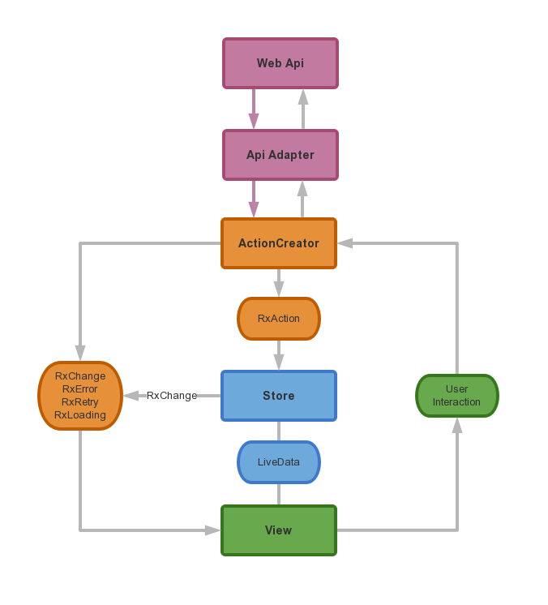
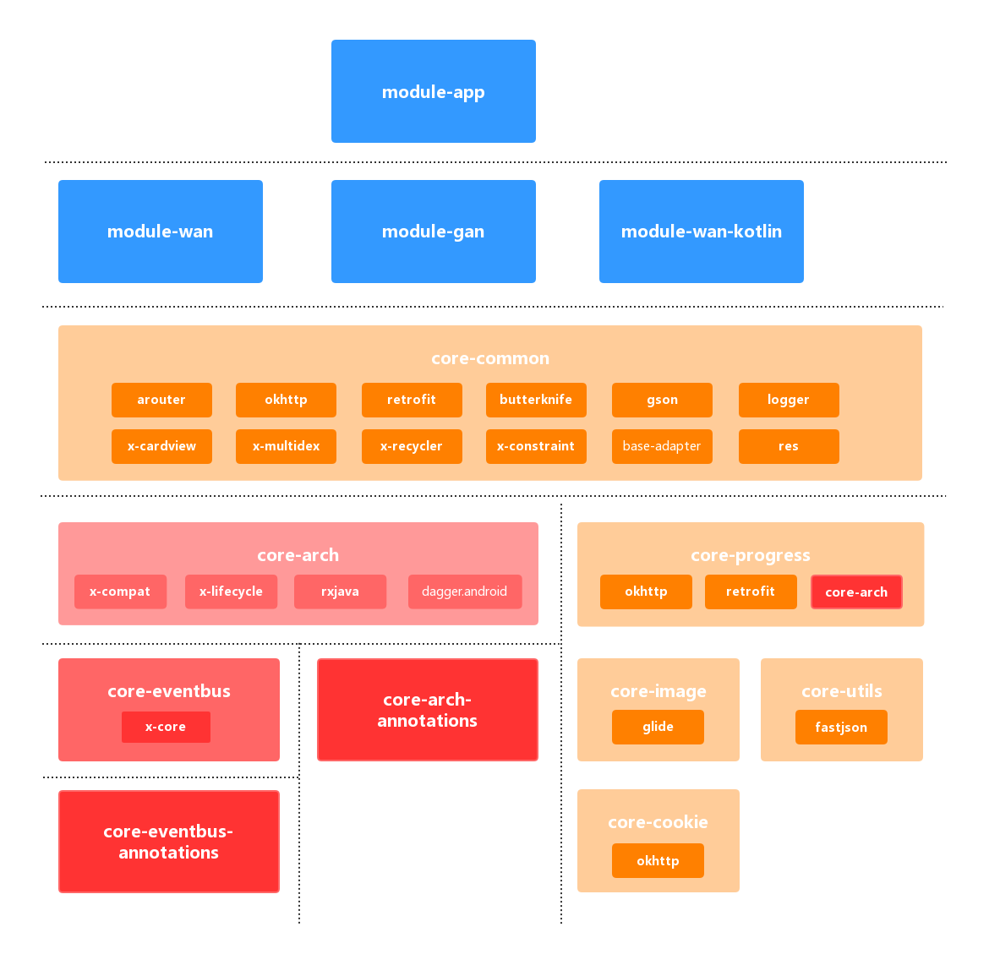

## 功能
- 使用Dagger.Android实现View(Activity/Fragment)的依赖注入
- Store中使用实现Tag功能的EventBus接收ActionCreator发送的数据
- View中使用实现Tag功能的EventBus接收Store发送的数据
- View,Store自动注册订阅、取消订阅
- Store（ViewModel）自动跟随View生命周期，维持设备横竖屏切换时数据
## 架构图

## 依赖框架
### 核心
- 依赖注入 [**Dagger+Dagger.Android**](https://github.com/google/dagger)
- 函数编程 [**RxJava**](https://github.com/ReactiveX/RxJava)
+[**RxAndroid**](https://github.com/ReactiveX/RxAndroid)
- AndroidX [**X-Core**](https://mvnrepository.com/artifact/androidx.core/core)
+[**X-AppCompat**](https://mvnrepository.com/artifact/androidx.appcompat/appcompat)
+[**X-Lifecycle**](https://mvnrepository.com/artifact/androidx.lifecycle/lifecycle-extensions)
- AndroidX迁移 [**Jetifier**](https://mvnrepository.com/artifact/com.android.tools.build.jetifier/jetifier-core)
### 通用
- 模块路由 [**Arouter**](https://github.com/alibaba/ARouter)
- View注入 [**ButterKnife**](https://github.com/JakeWharton/butterknife)
- 网络框架 [**OkHttp**](https://github.com/square/okhttp)
+[**OkIo**](https://github.com/square/okio)
+[**Retrofit**](https://github.com/square/retrofit)
- 图片加载 [**Glide**](https://github.com/bumptech/glide)
- 日志展示 [**Logger**](https://github.com/orhanobut/logger)
- 数据解析 [**Fastjson**](https://github.com/alibaba/fastjson)
+[**Gson**](https://github.com/google/gson)
- 内存泄漏 [**LeakCanary**](https://github.com/square/leakcanary)
- 通用适配 [**BaseRecyclerViewAdapterHelper**](https://github.com/CymChad/BaseRecyclerViewAdapterHelper)
- AndroidX [**X-Multidex**](https://mvnrepository.com/artifact/androidx.multidex/multidex)
+[**X-Fragment**](https://mvnrepository.com/artifact/androidx.fragment/fragment)
+[**X-CardView**](https://mvnrepository.com/artifact/androidx.cardview/cardview)
+[**X-RecyclerView**](https://mvnrepository.com/artifact/androidx.recyclerview/recyclerview)
+[**X-Material**](https://mvnrepository.com/artifact/com.google.android.material/material)
+[**X-Collection**](https://mvnrepository.com/artifact/androidx.collection/collection)
+[**X-ConstraintLayout**](https://mvnrepository.com/artifact/androidx.constraintlayout/constraintlayout)
### 测试 
- [**Junit**](https://github.com/junit-team/junit4)
- [**Mockito**](https://github.com/mockito/mockito)
- [**RESTMock**](https://github.com/andrzejchm/RESTMock)
- [**Powermock**](https://github.com/powermock/powermock)
- [**Robolectric**](https://github.com/robolectric/robolectric)
- [**Daggermock**](https://github.com/fabioCollini/DaggerMock)
- [**X-Test-Core**](https://mvnrepository.com/artifact/androidx.test/core)
- [**X-Test-Junit**](https://mvnrepository.com/artifact/androidx.test.ext/junit)
- [**X-Test-Rules**](https://mvnrepository.com/artifact/androidx.test/rules)
- [**X-Test-Runner**](https://mvnrepository.com/artifact/androidx.test/runner)
- [**X-Test-Espresso**](https://mvnrepository.com/artifact/androidx.test.espresso/espresso-core)
- [**X-Test-Fragment**](https://mvnrepository.com/artifact/androidx.fragment/fragment-testing)
# License
Copyright 2019 liujunfeng

Licensed under the Apache License, Version 2.0 (the "License"); you may not use this file except in compliance with the License. You may obtain a copy of the License at

[http://www.apache.org/licenses/LICENSE-2.0](http://www.apache.org/licenses/LICENSE-2.0)

Unless required by applicable law or agreed to in writing, software distributed under the License is distributed on an "AS IS" BASIS, WITHOUT WARRANTIES OR CONDITIONS OF ANY KIND, either express or implied. See the License for the specific language governing permissions and limitations under the License.
